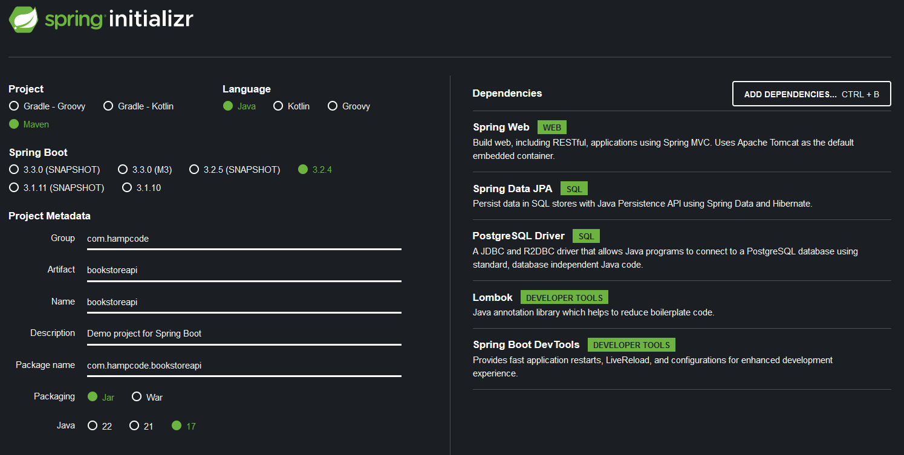
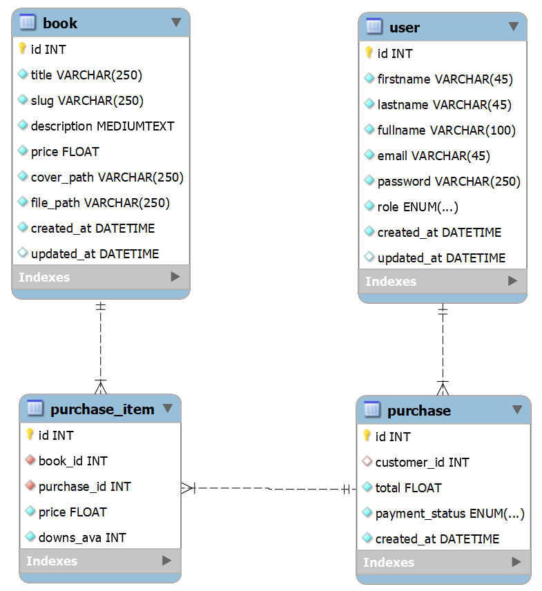

## Laboratorio

Aprenderás a desarrollar una API REST utilizando los siguientes proyectos de Spring Framework y bibliotecas

- [Spring Boot](https://docs.spring.io/spring-boot/docs/current/reference/html/getting-started.html#getting-started.introducing-spring-boot)
- [Spring Data JPA](https://docs.spring.io/spring-data/jpa/reference/jpa.html)
- [Spring Security](https://docs.spring.io/spring-security/reference/index.html)
- [JSON Web Tokens](https://jwt.io/introduction)

## Índice

1. [Dependencias](#dependencias)
2. [Requisitos funcionales](#requisitos-funcionales)
3. [Modelo de base de datos](#modelo-de-base-de-datos)
4. [Implementación de los endpoints para gestionar los libros](#implementación-de-los-endpoints-para-gestionar-los-libros)


## Dependencias
[Spring initializr](https://start.spring.io/#!type=maven-project&language=java&platformVersion=3.2.4&packaging=jar&jvmVersion=17&groupId=com.hampcode&artifactId=bookstoreapi&name=bookstoreapi&description=Demo%20project%20for%20Spring%20Boot&packageName=com.hampcode.bookstoreapi&dependencies=web,data-jpa,postgresql,lombok,devtools)



[Volver al Índice](#índice)

## Requisitos funcionales

| N° | Descripción                                                                                                  | Detalles                                                                                                     |
|----|--------------------------------------------------------------------------------------------------------------|--------------------------------------------------------------------------------------------------------------|
| 1  | Como administrador, quiero poder gestionar los libros de la tienda, para mantener actualizado el inventario. | El libro debe tener los siguientes datos: título, descripción, precio, portada, archivo PDF, fecha de creación y fecha de actualización. |
| 2  | Como administrador, quiero poder gestionar los usuarios de la tienda, para administrar los permisos y privilegios de acceso. | El usuario debe tener los siguientes datos: nombre, apellido, email, contraseña, rol, fecha de creación y fecha de actualización. El rol puede ser administrador o usuario normal. |
| 3  | Como visitante, quiero poder iniciar sesión o registrarme si no tengo una cuenta, para acceder a funciones exclusivas. | Para iniciar sesión debe requerirse el email y la contraseña. Para registrarse se debe requerir el nombre, apellido, email y la contraseña. |
| 4  | Como visitante, quiero poder visualizar un catálogo de los últimos libros agregados, para estar al tanto de las novedades. | Esta debe mostrarse en la página de inicio. Para ello se debe considerar los 6 últimos libros agregados y ordenados en base a la fecha de creación. |
| 5  | Como visitante, quiero poder visualizar el catálogo completo de los libros de la tienda, para explorar todas las opciones disponibles. | Esta debe mostrarse en una página con los libros ordenados en base al título. La carga debe ser similar a las noticias en Facebook (cuando se hace scroll hacia abajo). |
| 6  | Como visitante, quiero poder agregar los libros a un carrito de compras, para poder comprar varios productos a la vez. | Cada libro debe mostrar un botón para agregar o quitar del carrito de compras. |
| 7  | Como visitante, quiero poder pagar la compra usando PayPal, para realizar transacciones de forma segura y conveniente. | Si este proceso resulta correcto, redirigir al usuario a la página de detalles de compra. Si falla, se debe volver al carrito de compras. |
| 8  | Como sistema, quiero registrar la compra y permitir la descarga de los libros, para proporcionar una experiencia de compra completa y satisfactoria. | La venta debe tener los siguientes datos: el monto total, el cliente (si el usuario estaba autenticado), la fecha de creación y los items. Cada ítem debe guardar el libro y su precio con el que se compró. El sistema debe restringir el número de descargas de cada ítem a 3 como máximo. |

[Volver al Índice](#índice)

## Modelo de base de datos


[Volver al Índice](#índice)

## Implementación de los endpoints para gestionar los libros
- Descargar los cambios de la rama `feature/implement-book-endpoints`:
  ```bash
  git pull origin feature/implement-book-endpoints
  ```

- En esta implementación se abordaron las siguientes tareas:
  - Mapeo de la entidad Book.
  - Creación del repositorio.
  - Creación del controlador.

- La configuración del `src/resources/application.properties`. Debes colocar password de tu instalación de PostgreSQL

  ```bash
  # Configuración de la ruta base para la API v1
  server.servlet.context-path= /api/v1

  # Configuración de la base de datos PostgreSQL
  spring.datasource.url=jdbc:postgresql://localhost:5432/bookstoredb
  spring.datasource.username=postgres
  spring.datasource.password=admin

  # Configuración de JPA
  spring.jpa.properties.hibernate.dialect=org.hibernate.dialect.PostgreSQLDialect
  spring.jpa.hibernate.ddl-auto=update
  spring.jpa.show-sql=true
     ```

[Volver al Índice](#índice)  

